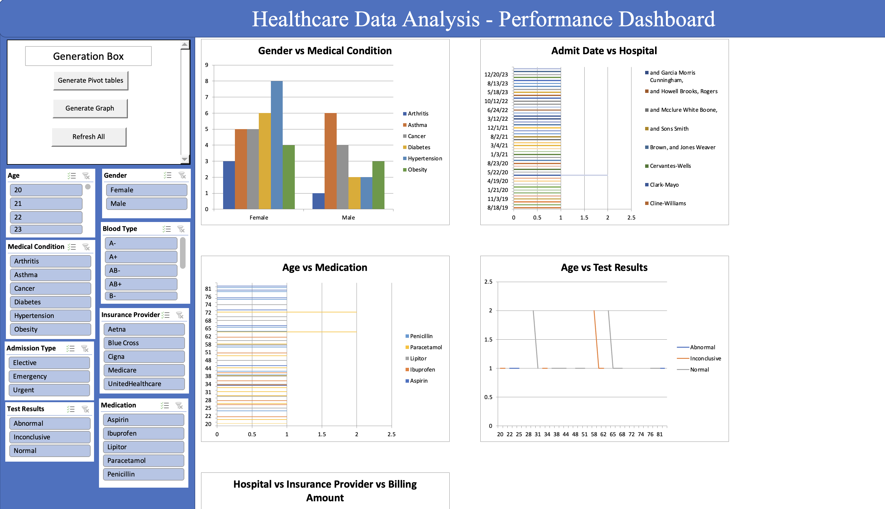

# Healthcare-data-analysis---Excel-dashboard-using-VBA
# Excel VBA Healthcare Dashboard

## Overview

This project is an **Excel-based interactive dashboard** for healthcare data analysis, developed using **VBA (Visual Basic for Applications)**. The project automates the creation of multiple pivot tables and dynamically generates charts to offer insights into healthcare data. The dashboard enables users to analyze various metrics such as patient demographics, hospital admissions, billing data, and test results.

The dataset for this project was collected from **Kaggle**, a platform offering diverse datasets for data science and machine learning projects. This project demonstrates how Excel and VBA can be used effectively for advanced data analysis and visualization.

## Dashboard 

Here’s a preview of the Excel VBA healthcare dashboard:



## Features

- **Automated Pivot Table Generation**: VBA code automatically creates multiple pivot tables from the healthcare dataset, placing each pivot table on its own sheet.
- **Custom Charts**: The project generates different types of charts (e.g., line charts, bar charts, pie charts) to visualize healthcare metrics.
- **Slicer Integration**: A slicer is included for filtering data across multiple pivot tables, providing dynamic filtering of the charts.
- **Refresh Capability**: All pivot tables and charts can be refreshed with a single click to reflect the latest data.
- **Adaptable for New Datasets**: The VBA code can be modified to support different datasets or additional metrics.

## Dataset

- **Source**: The healthcare dataset used in this project was collected from [Kaggle](https://www.kaggle.com/). Kaggle is a platform that provides datasets for machine learning and data analysis.
- **Dataset Description**: The dataset contains information on patient demographics, hospital admissions, billing, test results, and more. Each record corresponds to a healthcare interaction and includes details such as the patient's age, gender, medical condition, hospital of admission, billing amount, and test outcomes.

### Fields from the Dataset:
- **Name**: Patient name (anonymized).
- **Age**: Patient's age in years.
- **Gender**: Gender of the patient.
- **Hospital**: Hospital where the patient was admitted.
- **Medical Condition**: The medical condition being treated.
- **Admission Date**: The date of patient admission to the hospital.
- **Discharge Date**: The date of patient discharge.
- **Billing Amount**: The total cost of treatment.
- **Test Results**: Results of medical tests, with possible values such as "normal", "abnormal", and "inconclusive".

## Project Structure

```plaintext
Excel-VBA-Healthcare-Dashboard/
│
├── Dashboard.xlsm              # Main Excel file containing the dashboard and VBA macros
├── README.md                   # Project documentation (this file)
├── Modules/                    # Exported VBA code modules (optional)
│   ├── CreatePivotTables.bas   # VBA code for creating pivot tables
│   ├── CreateCharts.bas        # VBA code for generating charts
│   └── RefreshAll.bas          # VBA code to refresh pivot tables and charts

## Acknowledgements
Kaggle: Special thanks to Kaggle for providing the dataset used in this project.
Microsoft Excel: This project heavily relies on the functionalities provided by Excel's VBA.
